# SahayataLoan 

**Peer-to-Peer Lending Platform for Small Businesses in India**  
SahayataLoan is a digital platform that empowers small, community-based businesses in India by connecting them directly with individual lenders. Our goal is to make borrowing easier, fairer, and more accessible—especially for those underserved by traditional financial institutions.

> In India, many small and micro-businesses struggle to access affordable credit due to a lack of collateral, formal credit history, or complex banking systems. **SahayataLoan** aims to bridge this gap by creating a **peer-to-peer (P2P) lending platform** that allows individual lenders to directly fund loans for small businesses they believe in.


## ✨ Features

- 👤 **Borrower Profiles** – Community businesses can register and apply for loans  
- 💸 **Lender Dashboard** – Individuals can browse loan requests and fund them  
- 📄 **Loan Management** – Transparent terms, interest tracking, and repayment schedules  
- 📈 **Repayment Tracking** – View live repayment status and history  
- 🔐 **Secure Authentication** – Using Supabase Auth for users and admins  
- 🧾 **Admin Panel** – Verify borrowers, manage listings, and moderate disputes


## ⚙️ Tech Stack

| Layer       | Technology              |
|-------------|--------------------------|
| Backend     | Node.js, TypeScript      |
| Database    | PostgreSQL (via Supabase)|
| Auth        | Supabase Auth / JWT      |
| Frontend    | TBD (React, Flutter, etc.)|
| APIs        | REST / Supabase RPC      |


## 🏗 Architecture

```plaintext
[Borrower] ↔
            ↘
            [Frontend App] ↔ [Backend API] ↔ [Supabase DB & Auth]
            ↗
[Lender] ↔
            ↕
       [Payment Gateway Integration]

```


## 🌁 Website Demonstration 

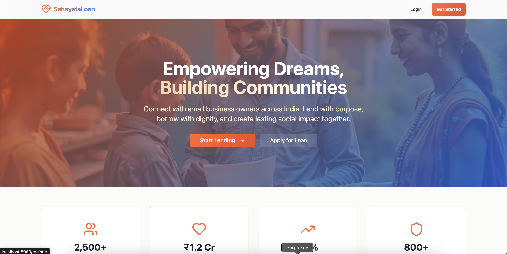 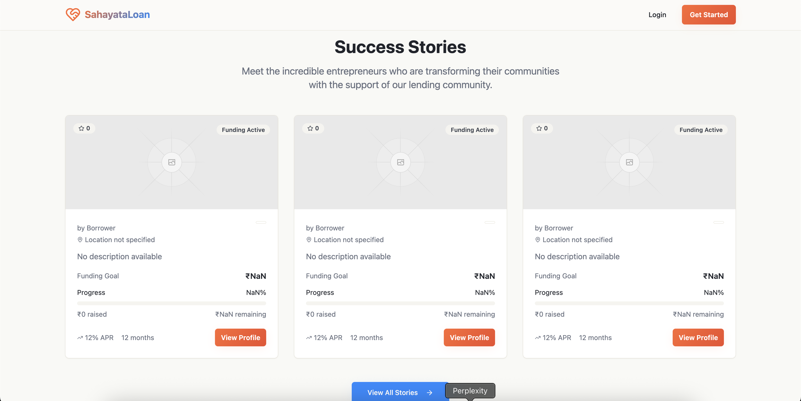 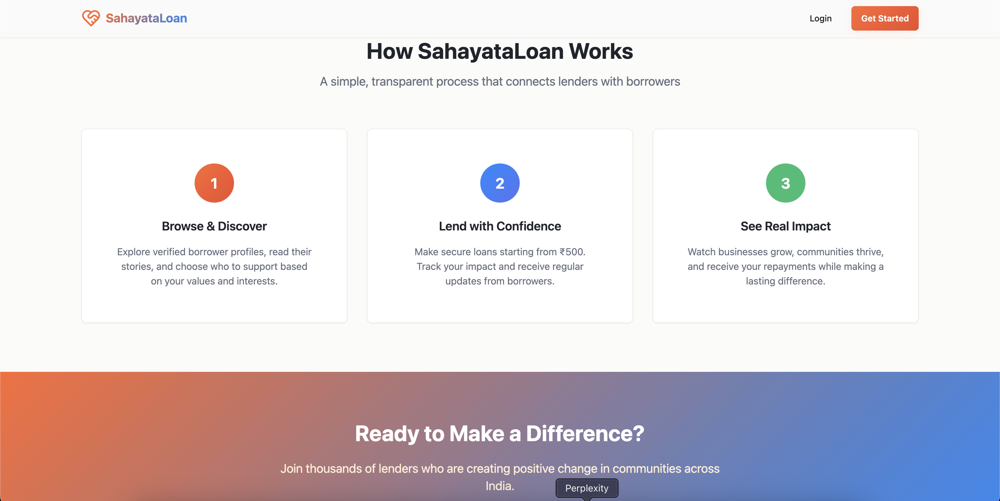 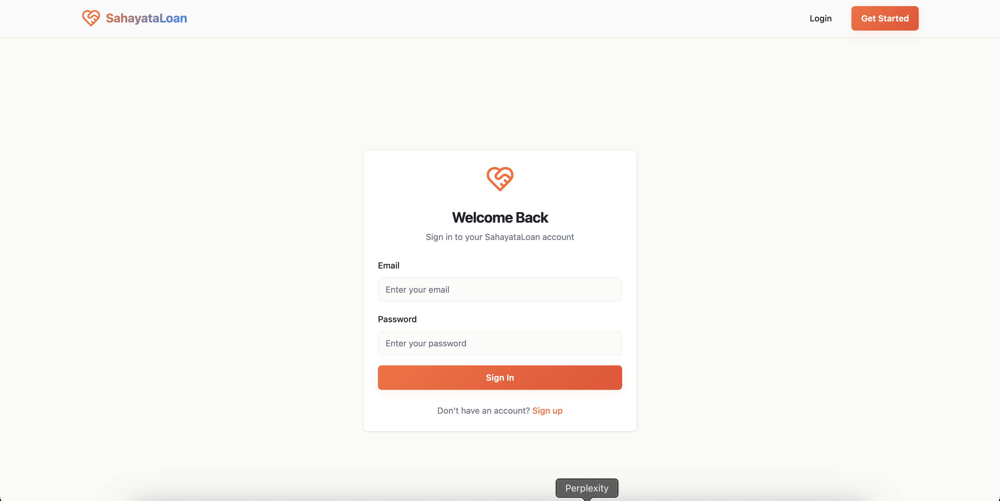 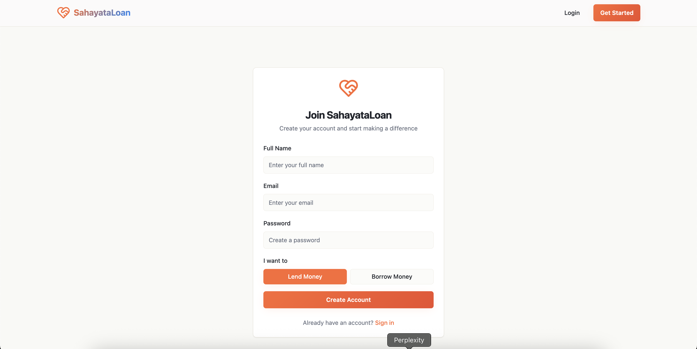 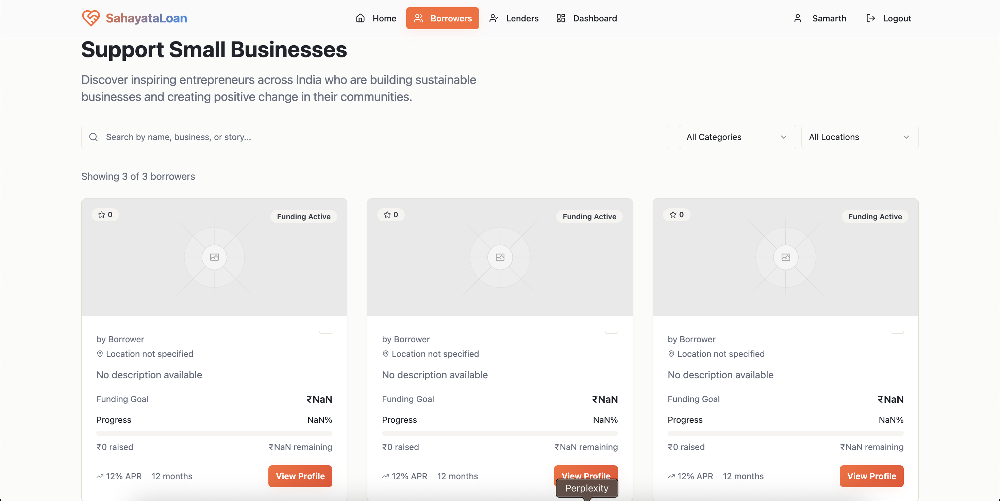 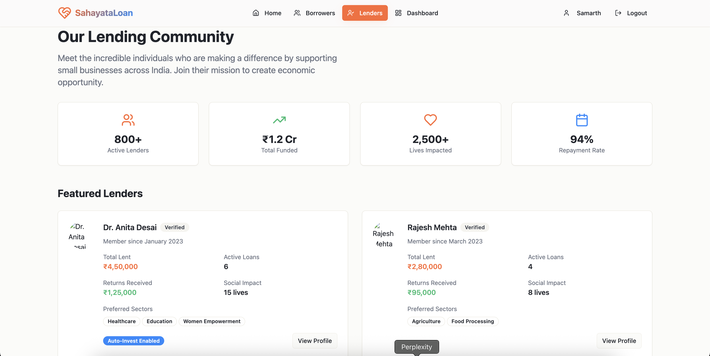 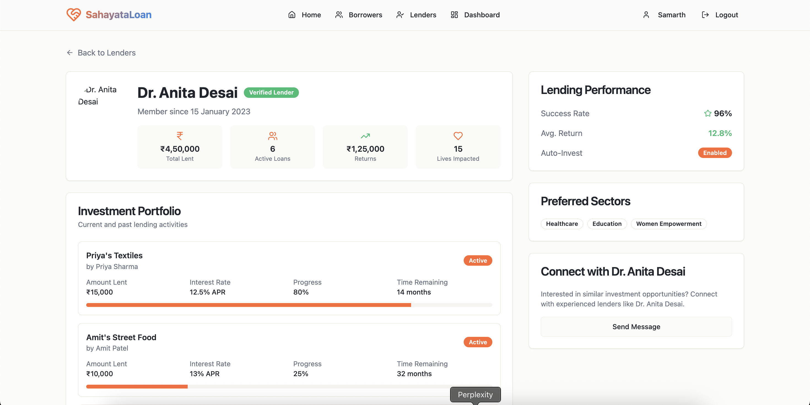 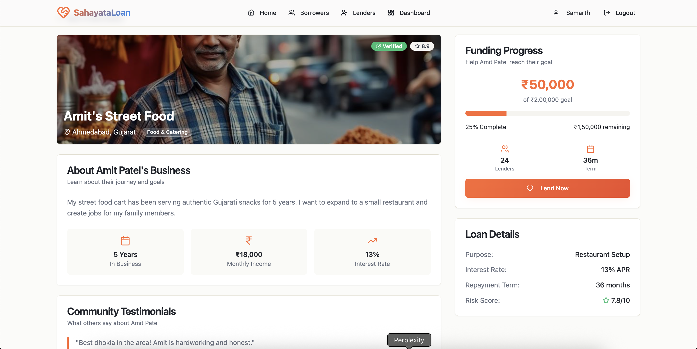 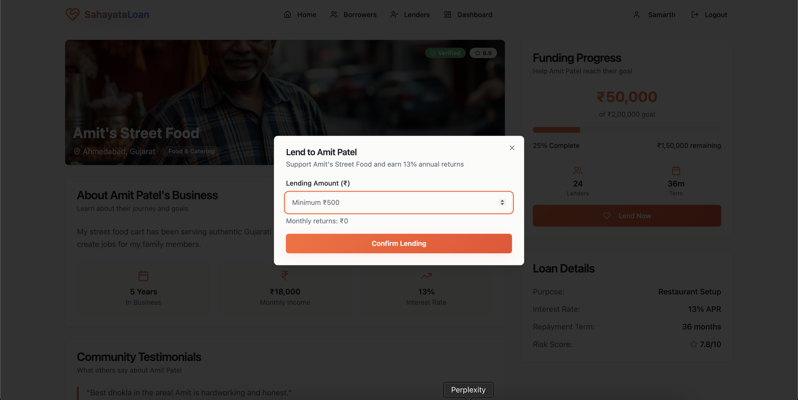 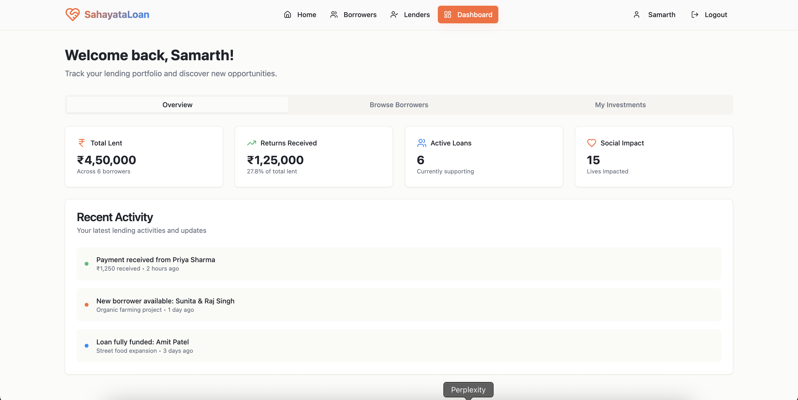 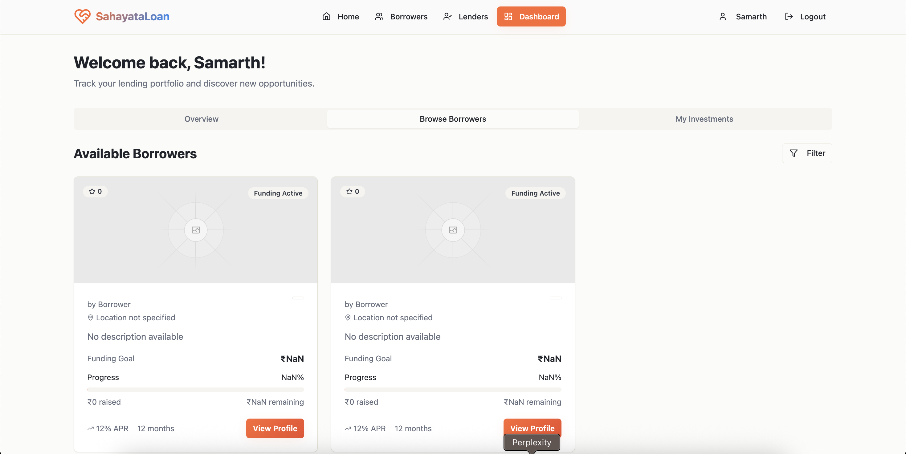 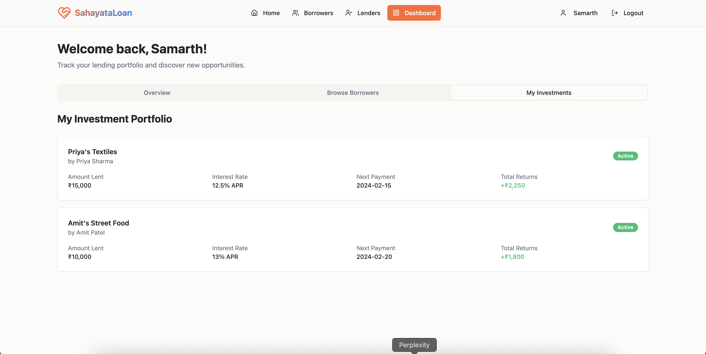   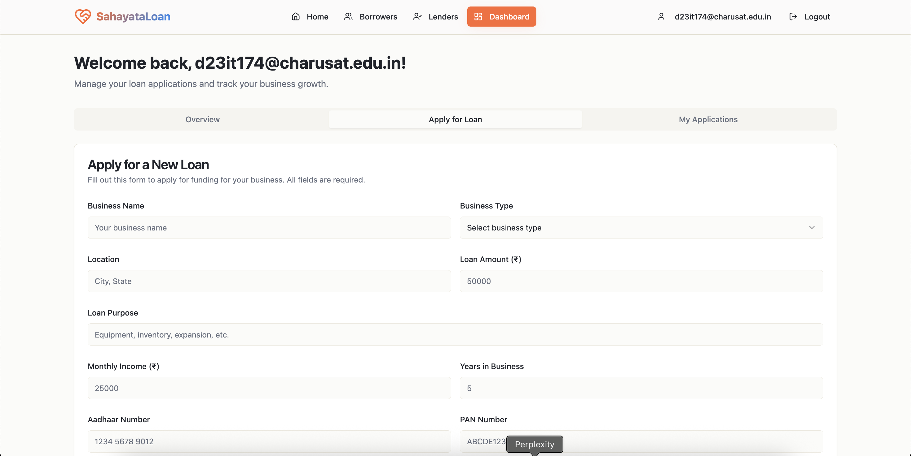 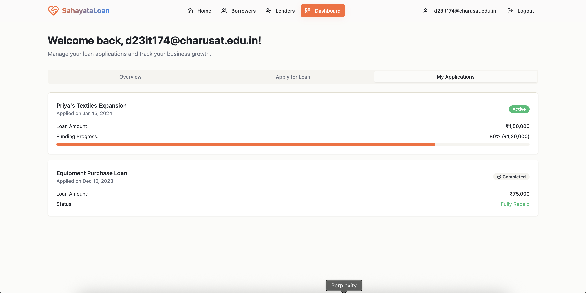

> Database Schema's

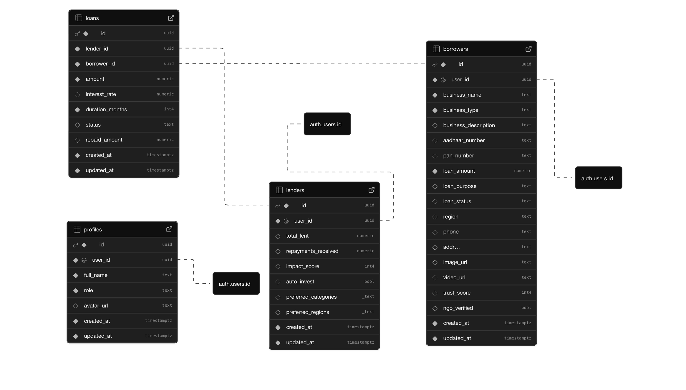


## 🧪 Usage

**For Borrowers:**

- Register and complete profile verification
- Apply for a loan with purpose, amount, and repayment terms
- Track funding and repayment status

**For Lenders:**

- Sign up and explore active loan requests
- Fund a loan directly or in part
- Monitor repayment and impact


## 🔮 Next Suggestions

If you’d like to further improve the repo, I can help you with:

- Supabase schema setup (for borrowers, lenders, loans, repayments)
- Frontend UI template (React or Flutter)
- Integrating payment gateways
- Adding real-world borrower demo data (for showcasing the MVP)

> Let me know and I’ll help you generate those too.